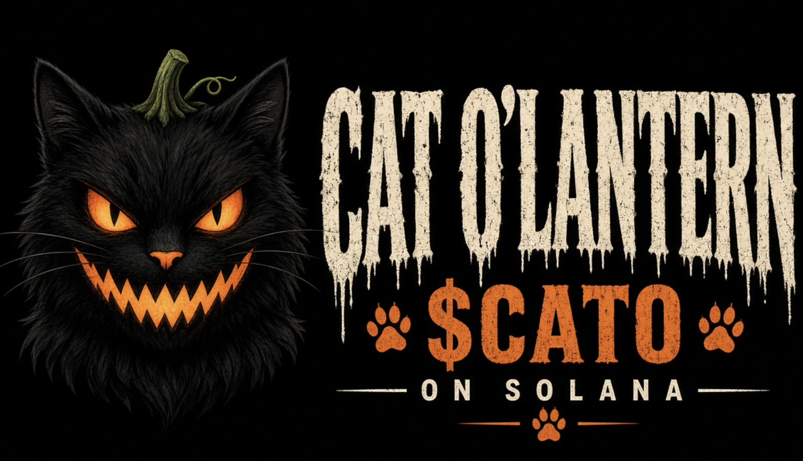
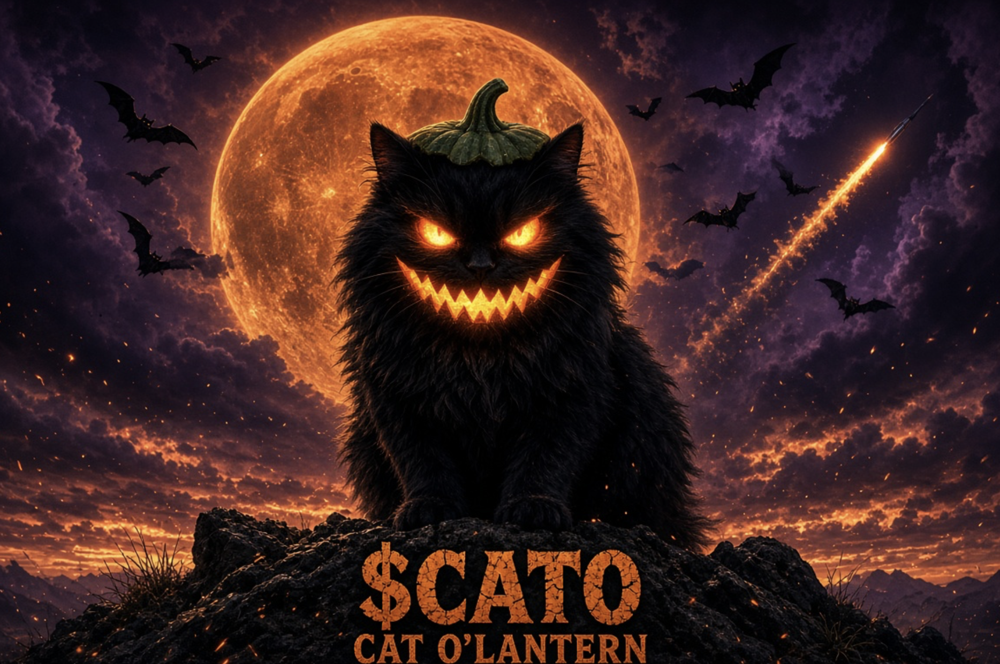

# 🎃 CAT O'LANTERN - Images Setup Guide

This guide will help you add your images to replace the SVG placeholders on the website.

## 📁 Image Files Needed

Add the following images to the `/images` folder:

### 1. **cat-o-lantern-hero.png**
- **Usage**: Hero section (right side visual)
- **Recommended Size**: 400x400px or 500x500px
- **Format**: PNG with transparency
- **Description**: Cat face with pumpkin head image
- **File Path**: `/Users/ichbinzik/cato'lantern/images/cat-o-lantern-hero.png`

### 2. **cat-o-lantern-full.png**
- **Usage**: Featured section showcase (left side)
- **Recommended Size**: 600x600px or 800x800px
- **Format**: PNG with transparency
- **Description**: Full pumpkin cat with moon background and bats
- **File Path**: `/Users/ichbinzik/cato'lantern/images/cat-o-lantern-full.png`

---

## 📝 Step-by-Step Instructions

### **Option 1: Using Finder (GUI)**
1. Open Finder and navigate to: `/Users/ichbinzik/cato'lantern/images/`
2. Drag and drop your images into this folder
3. Make sure filenames match exactly:
   - `cat-o-lantern-hero.png`
   - `cat-o-lantern-full.png`
4. Save and refresh http://localhost:8000

### **Option 2: Using Terminal**
```bash
# Copy images from your downloads or current location
cp ~/Downloads/cat-o-lantern-hero.png /Users/ichbinzik/cato\'lantern/images/
cp ~/Downloads/cat-o-lantern-full.png /Users/ichbinzik/cato\'lantern/images/

# Verify files were added
ls -la /Users/ichbinzik/cato\'lantern/images/
```

### **Option 3: Using VS Code**
1. Open the `/images` folder in VS Code
2. Right-click → "Reveal in Finder"
3. Drag your PNG files into the Finder window
4. They'll appear in VS Code immediately

---

## 🔄 What Happens After You Add Images

Once you add the images with the correct filenames:

### In `index.html`:
- The hero section will load `cat-o-lantern-hero.png` as an SVG overlay
- The featured section will display both images side-by-side
- Images will have hover effects and animations

### Current HTML References:
```html
<!-- Hero section uses this image -->


<!-- Featured section uses both -->


```

---

## ✅ Verification Checklist

After adding images, verify with:

```bash
# Check files exist
ls -lh /Users/ichbinzik/cato\'lantern/images/cat-o-lantern-*.png

# Check file sizes (should be > 0 bytes)
du -h /Users/ichbinzik/cato\'lantern/images/cat-o-lantern-*.png
```

Expected output:
```
-rw-r--r--  1 ichbinzik  staff   XXXKb  Sep 22 XX:XX  cat-o-lantern-hero.png
-rw-r--r--  1 ichbinzik  staff   XXXKb  Sep 22 XX:XX  cat-o-lantern-full.png
```

---

## 🚀 Deployment

After adding images:

1. **Test locally**: Visit http://localhost:8000 and refresh
2. **Commit to Git**:
   ```bash
   cd /Users/ichbinzik/cato\'lantern
   git add images/cat-o-lantern-*.png
   git commit -m "Add cat o'lantern images"
   git push origin main
   ```
3. **Deploy to Vercel** or your hosting platform

---

## 📋 Image File Naming Rules

⚠️ **IMPORTANT**: Filenames are case-sensitive on some systems!

✅ **Correct**:
- `cat-o-lantern-hero.png`
- `cat-o-lantern-full.png`

❌ **Incorrect**:
- `Cat-O-Lantern-Hero.png`
- `CAT-O-LANTERN-FULL.PNG`
- `cat_o_lantern_hero.png` (underscores instead of hyphens)

---

## 🎨 Image Format Recommendations

- **Format**: PNG (for transparency) or JPG (for solid backgrounds)
- **Compression**: Use TinyPNG or ImageOptim to compress
- **Dimensions**: Square format recommended (1:1 ratio)
- **Resolution**: 72-150 DPI for web

---

## 🆘 Troubleshooting

**Images not showing?**
1. Verify filenames match exactly (case-sensitive)
2. Check browser console (F12) for 404 errors
3. Clear browser cache (Cmd+Shift+Delete on Mac)
4. Restart the local server: `python3 -m http.server 8000`

**File permission issues?**
```bash
chmod 644 /Users/ichbinzik/cato\'lantern/images/cat-o-lantern-*.png
```

---

## 📞 Need Help?

The website currently displays SVG placeholder images. Once you add the PNG files, they will automatically replace the placeholders with your actual images!

Good luck! 🎃✨
